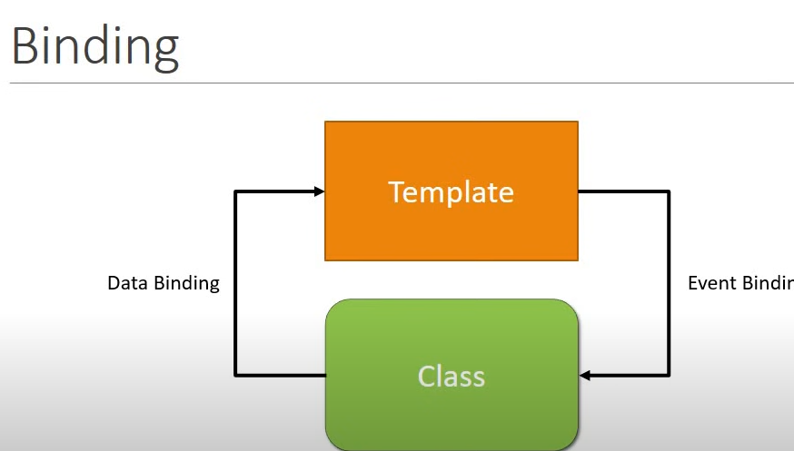
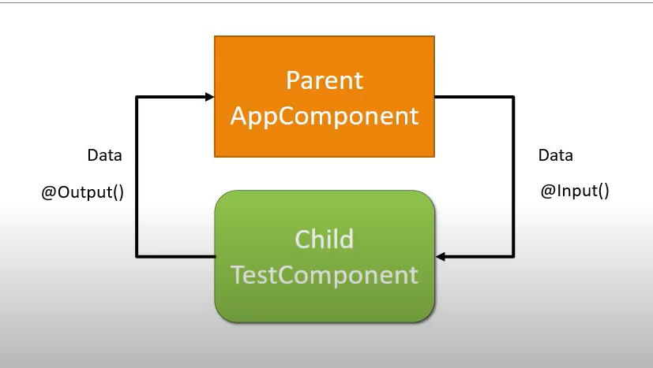
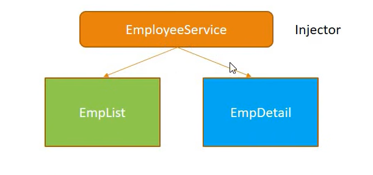
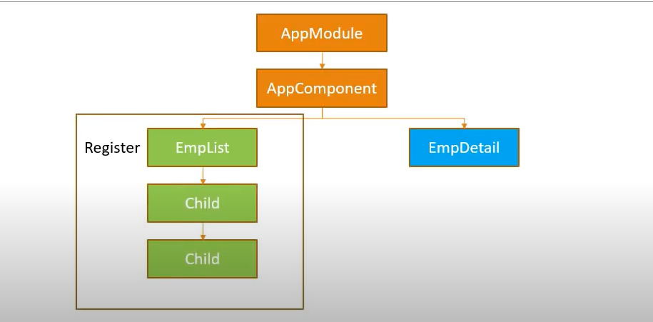
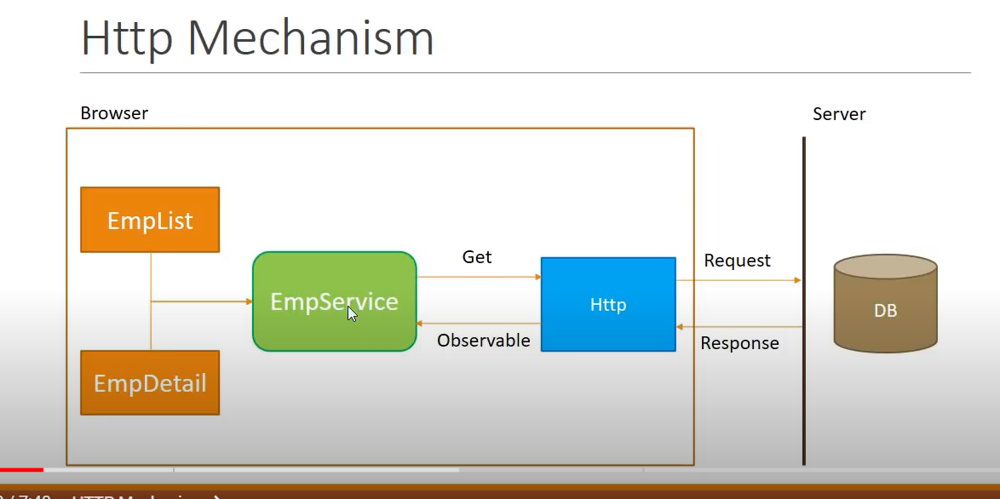
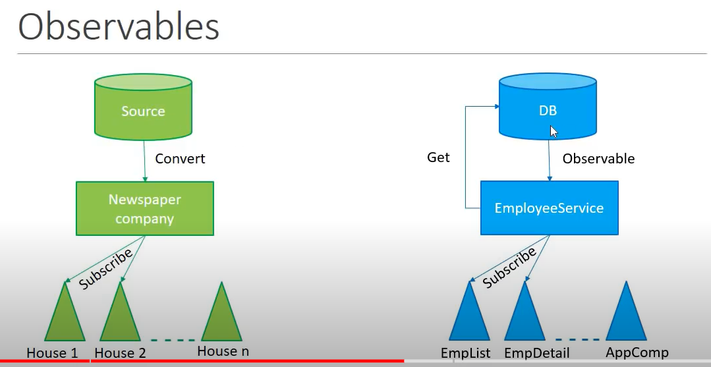

After index.html loads everything after that is angular components 
First when you run ng serve  
- starts with main.ts
- goes to app.module.ts
- goes to app.component.ts

        import {Component, OnInit} from '@angular/core'

        @Component({ // contains metadata as well as template to update the view 
            selector:'app-test', //custom html tag that is used to represent this component
            template:`
            <h2>
                Welcome !!
            </h2>
            `,
            styles:[]

        }) // this is a function that attaches to the class below it which is TestComponent
        export class Testcomponent implements OnInit{
            constructor(){}

            ngOnInit(){
                
            }
        }

Command to generate component in angular 

    ng g c test

three ways to declare selectors: 
1. Default
2. Set as class by using . before and mentioning it in a div 

        

3. set as attribute by covering up the selector in []

        
 

## Attributes vs properties 

- Attributes are defined in html and properties are defined in DOM. Attributes initialize DOM properties and then they are done. These values cannot change once they are initialized 

[] - for property binding and () - for event binding.

property binding is class to template 
event binding is template to class

## Structural Diretives 

They allow us to allows us to add or remove html property from the DOM. 

The parent and child components communicate with each other using *input* and *output* decorators 

## Pipes

They allow us to transform data before displaying them in view

## Service 
It is a class with a specific purpose 
1. Share data
2. Implement Application logic 
3. External  interaction

Naming cinvention - .service.ts
Services are usingin Angular using Dependency injection 

Dependency injection is a design pattern that helps in being contorl of the code. It is a design pattern that receives its dependencies from external sources rather than creating them itself

When there are multiple dependencies for a class and some dependecies are inturn dependent on each other then managing it becomes difficult. So Angular provides an *injector* where you register all your dependencies. It acts as a container for all the dependencies.

Dependecies are only called services. We register all these services with  the injector. Thus when any component is initialized the injector provides all the necesary dependencies.

### Steps

- Create a service Class
- reister the service class with angular built in injector 
- declare the service as dependency in which it is needed

You cannot register the dependency anywhere. Angular has hierarchical Dependency injection system. Only the children of the component or module can use that dependency 

It is better to register the dependency in the app module so all components under uit cn use it. 

Include the service in the providers in the app. 

here the response which you get from the http to the service is called an observable. An observable is a sequence of items that arrive asynchronously over time. Indirectly the http response is an observable in angular. the observable is converted into the desired format.

Rxjs is library that helps us to work with observables in angular 

## Relatove Navigation
When you use absolute paths as routes they are not flexible when you have a requirement of changing them 
